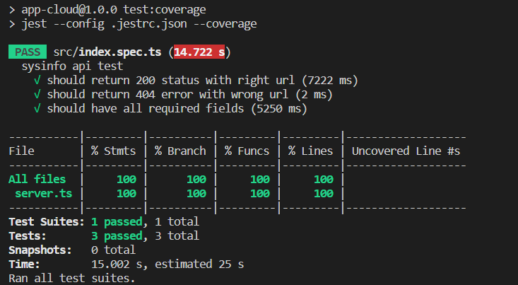
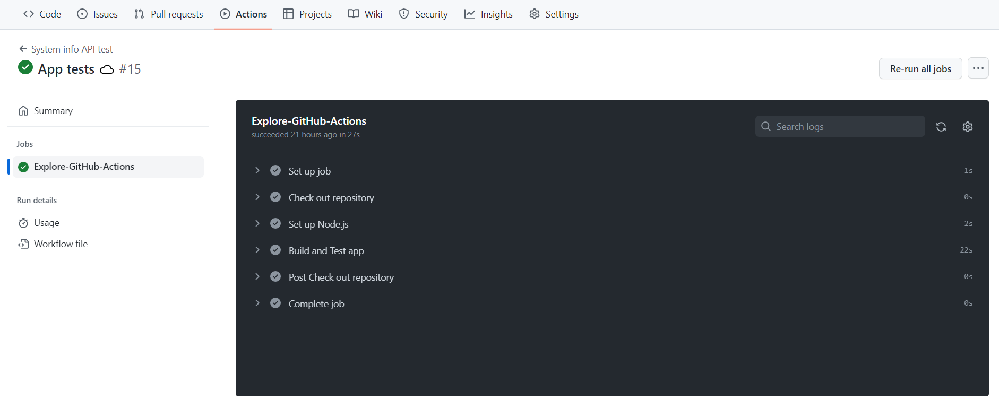

# Cloud programming
> Sam Nzongani 
> ENSTA Bretagne - CSN 2023

## Questions
---

### 1. Environment
I chose to use Windows as my environment.

"Pain is inevitable, suffering is optional." *—Buddhist Proverb*

### Package files
The file ``package.json`` contains info about:
- the project (name, author, github url, dependencies versions...)
- script commands (describe commands to execute with specified names)

The file ``package-lock.json`` contains info about all the node modules installed:
- version
- url
- integrity code
- other dependencies...

### 3. System information
Install the [systeminformation](https://www.npmjs.com/package/systeminformation) module:

```
npm i systeminformation
```

If successfully installed, it is added to the ``package*.json`` files:

For example in ``package.json``:

```
  "dependencies": {
    "systeminformation": "^5.12.13"
  }
```

The file contains (among others) the fields **dependencies** and **devDependencies**.
The first one lists the installed modules *for the app to use*.
The second lists the development modules used to *build the app*.

### App code
---
The code for the app is distributed in 3 files:
- server.ts
- interface.ts
- index.ts

The first one contains methods to:
- create a http server
- start & close the server
- fetch system info

The second one describes the format of the data we want to retrieve.

Finally, the last one calls the methods defined in the other two.

This organisation makes it easier to understand and modify the code.

### Curl test
---
With the command ``curl http://localhost:8000/api/v1/sysinfo`` we get:
```
system: {
    manufacturer: 'ASUSTeK COMPUTER INC.',
    model: 'VivoBook_ASUSLaptop X571GT_A571GT',
    version: '1.0',
    serial: 'L7N0CX014414276',
    uuid: '256b4525-94f4-574f-a0bc-dbeadc79f659',
    sku: '',
    virtual: false
  },
  mem: {
    total: 8435277824,
    free: 1415364608,
    used: 7019913216,
    active: 7019913216,
    available: 1415364608,
    buffers: 0,
    cached: 0,
    slab: 0,
    buffcache: 0,
    swaptotal: 7247757312,
    swapused: 717225984,
    swapfree: 6530531328
  }
```
The data retrieved is way bigger and includes all properties defined in the interface which is why I only gave **system** and **mem** as an example above.

A request to ``http://localhost:8000`` returns the following:
```
curl : Le serveur distant a retourné une erreur: (404) 
Introuvable.
Au caractère Ligne:1 : 1
+ curl http://localhost:8000
+ ~~~~~~~~~~~~~~~~~~~~~~~~~~
    + CategoryInfo          : InvalidOperation : (System.Net.Http  
   WebRequest:HttpWebRequest) [Invoke-WebRequest], WebException    
    + FullyQualifiedErrorId : WebCmdletWebResponseException,Micro  
   soft.PowerShell.Commands.InvokeWebRequestCommand
```

The formalism used to build the API url allows different versions *(v1, v2, ...)* that could each point toward different information. It gives developpers some freedom.
### Jest testing
---
[Jest](https://jestjs.io/fr/) is a JavaScript testing framework.
The file **.jestrc.json** indicates that tests are written in **index.spec.ts**:
```
{
  "preset": "ts-jest",
  "testEnvironment": "node",
  "testMatch": ["**/*.spec.ts"]
}
```

#### Tests
I chose to test the server and the fetched data.

Server tests:
- a request to a wrong url should return a 404 error
- a request to the right url (api/v1/sysinfo) should return a 202 status code (success)

Data tests:
- data fetched should have all required fields



### Docker
---
I created two Docker images:
- samnzo/sysinfo-api:0.0.1 (177.99 MB)
- samnzo/sysinfo-api:0.0.2 (53.85 MB)

The second one is way lighter than the second one because it only contains dependencies used for production (see [Docker multi-stage builds](https://docs.docker.com/build/building/multi-stage/))
---
Build image
```shell
docker build -t sysinfo-api:0.0.x .
```
Run image
```shell
docker run -p 8123:8000 -m1024m --cpus=1 sysinfo-api:0.0.x
```
Tag
```shell
docker tag sysinfo-api:0.0.x samnzo/sysinfo-api:0.0.x
```
Push to [Docker Hub](https://hub.docker.com/)
```shell
docker push samnzo/sysinfo-api:0.0.x
```
Pull from hub
```shell
docker pull samnzo/sysinfo-api:0.0.x
```

### Github Actions
---
For continuous integration the [tests are automatically performed](https://resources.github.com/whitepapers/github-actions-cheat/) everytime a push is made to the main branch.

Everytime a push is made to main:
- dependencies are installed ``npm ci``
- app is compiled ``npm run build``
- tests are performed ``npm run test:coverage``

```yml
name: System info API test
run-name: ${{ github.actor }} tests ☁️
on:
  push:
    branches:
      - main
jobs:
  Explore-GitHub-Actions:
    runs-on: ubuntu-latest
    steps:
      - uses: actions/checkout@v2
        name: Check out repository
      - uses: actions/setup-node@v1
        name: Set up Node.js
        with:
          node-version: 16.15.1
      - run: |
          npm ci
          npm run build
          npm run test:coverage
        name: Build and Test app
```



### Deployment
---
I used [fly.io](fly.io) to deploy the api.

Install flyctl
```powershell
iwr https://fly.io/install.ps1 -useb | iex
```
Log in
```powershell
flyctl auth login
```
Launch & Deploy
```powershell
flyctl launch --image samnzo/sysinfo-api:0.0.2
flyctl deploy
```

Deployment doesn't work at first because we need to put the port we use (8000) in the **fly.toml** file (8080 → 8000).

Succesfully deployed  ✔️ 
https://sysinfo-api-sam.fly.dev/

#### Continuous deployment
For continuous deployment the app is deployed everytime a push is made to the main branch.


